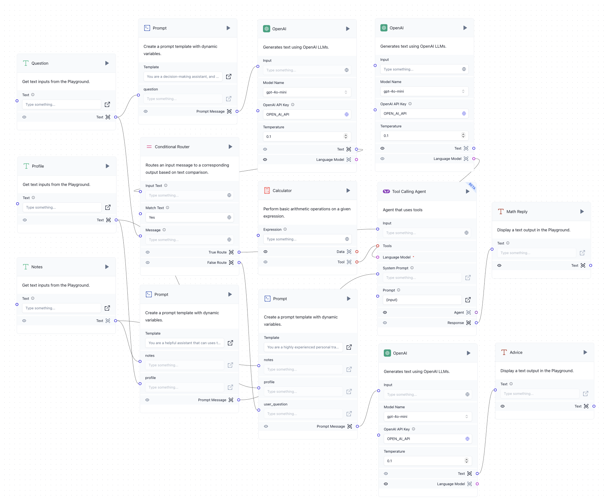

# Personal Fitness Tool

A Streamlit-based personal fitness app that leverages Langflow to provide tailored macro-nutritional advice and guidance. This tool manages users' personal fitness profiles and goals, generates dietary recommendations using AI, and stores notes and profiles in an Astra database.

## Table of Contents
1. [Overview](#overview)
2. [Features](#features)
3. [Architecture](#architecture)
4. [Setup](#setup)
5. [Usage](#usage)
6. [Langflow Configuration](#langflow-configuration)
7. [Acknowledgments](#acknowledgments)

---

## Overview

The Personal Fitness Tool provides a centralized platform for users to manage fitness-related information and receive AI-powered recommendations. With Langflow, the AI model dynamically processes inputs like user goals and personal data, giving actionable suggestions on nutrition and training. This tool employs Astra’s NoSQL database to store user data securely and efficiently.

## Features

- **Macros Generation**: Utilize Langflow-powered AI to generate dietary macros based on users' fitness goals.
- **Notes Management**: Save, retrieve, and delete fitness notes.
- **Ask AI**: Use language models to answer custom user questions based on their stored fitness profile and notes.
  
## Architecture

The following architecture is set up for efficient communication between the Streamlit interface, Langflow’s model interactions, and the Astra database.



## Setup

### Prerequisites

- **Python 3.10+**
- **Streamlit** for UI (`pip install streamlit`)
- **Langflow** setup and environment variable for API (`LANGFLOW_TOKEN`)
- **Astra DB** credentials (`ASTRA_ENDPOINT` and `ASTRA_DB_APPLICATION_TOKEN` in `.env` file)

### Installation

1. Clone the repository:
   ```bash
   git clone https://github.com/JohnNixon6972/Python-Multi-Agent
   cd Python-Multi-Agent
   ```

2. Install dependencies:
   ```bash
   pip install -r requirements.txt
   ```

3. Set up environment variables by creating a `.env` file and adding the following:
   ```dotenv
   LANGFLOW_TOKEN=<Your Langflow Token>
   ASTRA_ENDPOINT=<Your Astra DB Endpoint>
   ASTRA_DB_APPLICATION_TOKEN=<Your Astra Token>
   OPENAI_API_KEY=<Your OpenAI API Key>
   ```

4. Initialize the database collections using `db.py`.

5. Run the Streamlit app:
   ```bash
   streamlit run main.py
   ```

## Usage

### Main Features

- **Personal Data**: Fill out your name, age, weight, height, gender, and activity level, then click "Save" to update your profile.
- **Goals**: Select and save personal fitness goals.
- **Macros**: Generate dietary macros using AI or input your values.
- **Notes**: Manage and store custom notes related to fitness.
- **Ask AI**: Input questions for the AI to provide customized responses.

## Langflow Configuration

Langflow orchestrates the interactions between different models to enable personalized user guidance. By configuring flows within Langflow, models can respond accurately based on user-specific data, such as profile and goals, enabling adaptive recommendations. The AI flow files for `Ask AI` and `Macros Generation` are customized and stored as JSON files within the Langflow console.
